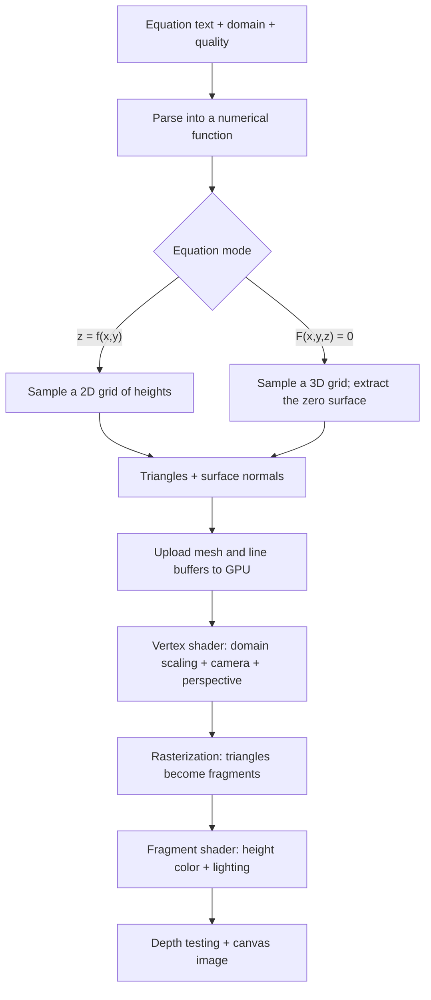

# How the rendering works

The renderer first turns the equation into a **triangle mesh in JavaScript**, then uses **WebGL to
project and shade those triangles**. The equation is evaluated on the CPU; the GPU receives positions
and surface normals.

The pipeline looks like this:



Here is what each stage does in this implementation.

## 1. Prepare WebGL

At startup, the app requests a WebGL context from the canvas with antialiasing enabled, an opaque
background, and `preserveDrawingBuffer` enabled so the rendered image can be exported.

`initializeGL()` then:

- Compiles a vertex shader and a fragment shader.
- Links them into one GPU program.
- Creates buffers for the surface, wireframe, floor grid, and axes.
- Enables depth testing.
- Sets the dark background color.

A **shader** is a small program executed by the GPU. The vertex shader handles vertex positions; the
fragment shader calculates colors.

These programs are initialized once and reused for subsequent equations. See
[renderer.js](js/renderer.js).

## 2. Turn equation text into a callable function

The parser converts an input such as:

```text
sin(sqrt(x^2 + y^2))
```

into a JavaScript function that can be called at numerical coordinates:

```js
f(x, y, z);
```

It does this in two stages.

First, it **tokenizes** the text into numbers, variable names, function names, operators, and
parentheses. It also normalizes notation: for example, `²` becomes `^2`, and `π` becomes `pi`.

Second, it parses those tokens according to mathematical precedence. Multiplication binds more
tightly than addition, powers bind more tightly than multiplication, and parentheses override the
usual order. It supports implicit multiplication such as `2x` and `xy`.

Rather than using `eval()` or `Function()`, the parser builds nested functions. For example, the
evaluator for `x^2 + y^2` conceptually calculates:

```js
Math.pow(x, 2) + Math.pow(y, 2);
```

For explicit mode, `z = ...` is optional, and only `x` and `y` are allowed in the expression.

For implicit mode, a full equation becomes a function whose zero set defines the surface:

```text
x^2 + y^2 + z^2 = 9
```

becomes:

```text
F(x,y,z) = x^2 + y^2 + z^2 - 9
```

The desired surface consists of points where `F` is zero. See
[equation-parser.js](js/equation-parser.js).

## 3. Sample the equation and construct triangles

A GPU can efficiently draw triangles, so the renderer needs a finite approximation of the
mathematical surface. The two equation modes construct that approximation differently.

The domain setting supplies `d`, giving a coordinate range of `−d` to `+d`. Quality supplies the number
of subdivisions, `n`:

| Quality | Explicit subdivisions | Implicit subdivisions |
| ------- | --------------------- | --------------------- |
| Low     | 48                    | 24                    |
| Medium  | 90                    | 38                    |
| High    | 150                   | 54                    |

Implicit mode uses fewer subdivisions because it samples a volume: its workload grows roughly with
\(n^3\), while explicit mode samples an area and grows roughly with \(n^2\).

For **explicit surfaces**, `surfaceMesh()` samples a regular grid in the x–y plane. Its spacing is:

\[
\text{step}=\frac{2d}{n}
\]

At each grid point, it evaluates the height:

\[
P\_{ij}=(x_i,\ y_j,\ f(x_i,y_j))
\]

Each square between four neighboring samples is split diagonally into two triangles.

At medium quality, this gives \(91^2=8{,}281\) sampled positions and up to
\(2\times90^2=16{,}200\) triangles.

Some triangles are omitted:

- A vertex is invalid if its height is nonfinite or outside `[-d,d]`.
- A triangle is rejected if any of its vertices is invalid.
- Large height jumps between vertices trigger a discontinuity heuristic.

That last check helps avoid drawing a bridge across an asymptote. It is a heuristic, so discontinuities
can still produce artifacts. Also, domain boundaries are handled by dropping triangles rather than
cutting them precisely at the boundary.

For **implicit surfaces**, `implicitMesh()` uses **marching tetrahedra**:

1. Sample `F` throughout a 3D grid.
2. Visit each small cube between neighboring samples.
3. Split the cube into six tetrahedra.
4. Find tetrahedra with both negative and nonnegative function values.
5. Locate approximate zero crossings along their edges.
6. Connect those crossings into triangles.

The underlying idea is that a continuous function changing sign along an edge must pass through zero.

For endpoints \(A\) and \(B\), the code estimates the crossing using linear interpolation:

\[
t=\frac{F(A)}{F(A)-F(B)},\qquad P=A+t(B-A)
\]

If `F(A) = −2` and `F(B) = 2`, the crossing is placed halfway along the edge.

A tetrahedron can produce one triangle or a quadrilateral split into two triangles, depending on how
its corners are divided by sign.

This lets implicit mode represent a whole sphere or torus, including surfaces with multiple heights
for the same `(x,y)`.

Because it depends on sampled signs, a very small feature can be missed. Equations that touch zero
without changing sign, such as a squared expression, can also be missed.

Both algorithms live in [geometry.js](js/geometry.js).

## 4. Calculate surface normals

A **normal** is a vector perpendicular to the surface. Lighting uses it to determine which parts face
toward the light.

For an explicit surface \(z=f(x,y)\), the normal direction is:

\[
N\propto\left(-\frac{\partial f}{\partial x},
-\frac{\partial f}{\partial y},1\right)
\]

The code estimates the derivatives with central differences:

\[
\frac{\partial f}{\partial x}
\approx\frac{f(x+h,y)-f(x-h,y)}{2h}
\]

It does the equivalent calculation for `y`, then normalizes the resulting vector to length one.

For an implicit surface, the normal follows the gradient:

\[
N\propto\nabla F=
\left(\frac{\partial F}{\partial x},
\frac{\partial F}{\partial y},
\frac{\partial F}{\partial z}\right)
\]

These derivatives are also estimated numerically. The implicit implementation omits the common
divisor `2h`, which does not affect the direction after normalization.

For a sphere, the gradient points radially outward. For a flat explicit surface, the normal is
`(0,0,1)`.

Using normals derived from the equation helps the lighting look smooth even though the geometry
consists of flat triangles.

## 5. Upload the geometry to the GPU

Each vertex contains six numbers:

```text
x, y, z, normalX, normalY, normalZ
```

The renderer converts these into a `Float32Array` and uploads them to a WebGL buffer.

Each vertex therefore occupies 24 bytes. `bind()` tells WebGL how to interpret those bytes:

- Position: three floats starting at byte 0.
- Normal: three floats starting at byte 12.
- Next vertex: 24 bytes later.

The mesh is **unindexed**: each triangle stores its own three vertex records, even when neighboring
triangles share positions.

The renderer also builds a wireframe buffer by copying all three edges of every triangle. Shared edges
are consequently stored more than once.

Finally, it builds the floor grid at `z = −d` and the three coordinate axes. All four buffers use the
same vertex layout and shader program. See `uploadMesh()` in [renderer.js](js/renderer.js).

## 6. Transform 3D vertices into the camera’s view

The vertex shader calculates:

```glsl
gl_Position = uMatrix * vec4(aPosition / uRange, 1.0);
```

There are three transformations involved.

First, dividing by the domain range maps the selected coordinates into roughly `[-1,1]`. This keeps a
domain of `[-12,12]` framed similarly to `[-2,2]`, while preserving proportions between axes.

Second, the **view matrix** expresses points relative to the camera. The camera is controlled by:

- `theta`: angle around the vertical axis.
- `phi`: angle down from the positive z direction.
- `zoom`: controls camera distance, calculated as `5.2 / zoom`.
- `panX` and `panY`: offsets in the viewing plane.

Third, the **perspective matrix** makes more distant objects appear smaller. The renderer uses a 45°
vertical field of view, adjusts for the canvas aspect ratio, and uses near/far clipping distances of
`0.1` and `100`.

The combined matrix is:

\[
M=P*{\text{perspective}}V*{\text{view}}
\]

Its output is a homogeneous position `(x,y,z,w)`. WebGL clips primitives and divides by `w` to obtain
normalized screen coordinates, which it maps into the canvas viewport.

Camera movement changes this matrix; it does not require rebuilding the mesh. See `viewMatrix()` in
[renderer.js](js/renderer.js).

## 7. Convert triangles into colors

After transforming the vertices, the GPU **rasterizes** each triangle: it determines which screen
samples the triangle covers.

For each resulting fragment—a candidate contribution to a pixel—it interpolates the vertex shader’s
outputs:

- `vHeight`: the original z coordinate.
- `vNormal`: the surface normal.

The fragment shader then calculates height color and lighting.

Height is normalized against the generated surface’s minimum and maximum:

\[
t=\operatorname{clamp}
\left(\frac{z-z*{\min}}{\max(z*{\max}-z\_{\min},0.001)},0,1\right)
\]

The color transitions from blue at low heights, through teal, to yellow-green at high heights.

Because each mesh uses its own height range, those colors indicate relative height within the current
surface.

Lighting uses a fixed directional light:

\[
L=\operatorname{normalize}(-0.4,-0.6,1)
\]

and brightness:

\[
b=0.48+0.52\,|N\cdot L|
\]

The dot product measures alignment with the light. The constant `0.48` keeps surfaces from becoming
completely dark. The absolute value gives the two opposite normal directions equal brightness, making
both sides readable.

The final color is:

\[
C*{\text{final}}=C*{\text{height}}\,b
\]

Normals and the light direction remain in world coordinates, so rotating the camera changes the view
while the lighting stays attached to the surface.

Grid, wireframe, and axis fragments take a simpler branch that outputs a uniform color. There are no
shadow maps, reflections, textures, or specular highlights.

## 8. Resolve visibility and compose the frame

Each `draw()` call clears the color and depth buffers, then draws:

1. The floor grid, if enabled.
2. Filled surface triangles, unless wireframe-only mode is selected.
3. Triangle edges, when requested.
4. The coordinate axes, if enabled.

**Depth testing** compares each fragment’s distance with the nearest fragment already stored at that
location. A nearer fragment can replace a farther one, allowing the front of a surface to hide its
back.

The filled surface uses `POLYGON_OFFSET_FILL`, which slightly shifts its depth values. This helps
wireframe edges remain visible over the triangles and reduces flickering called **z-fighting**.

The code does not enable face culling, so triangles remain visible from both sides.

The drawing resolution follows the canvas’s CSS size multiplied by the device pixel ratio, capped at
two. Axis labels are HTML elements positioned by projecting their 3D locations with the same camera
matrix. See `draw()` in [renderer.js](js/renderer.js).

## 9. Redraw only when something changes

The animation loop runs through `requestAnimationFrame()`, but it calls `draw()` only when `needsDraw`
is true.

Rotating, panning, zooming, resizing, or changing display options marks the view for redraw. Changing
the equation, domain, or quality rebuilds the mesh first.

Automatic rotation updates the camera angle using elapsed time and requests another draw. Hidden pages
skip drawing.

Although `build()` is declared `async`, the geometry calculation runs synchronously on the browser’s
main thread. It yields once beforehand so the “calculating” status can appear; expensive meshes can
still briefly block interaction.

The displayed milliseconds measure geometry generation, buffer upload, and related updates—not the
GPU’s completed frame time. The build and frame scheduling are in [ui.js](js/ui.js) and
[main.js](js/main.js).

PNG export forces a draw, copies the WebGL canvas into a separate 2D canvas, adds equation and domain
annotations, and encodes it as PNG. HTML overlays such as the axis labels are outside the WebGL canvas
and are not copied automatically. See [export.js](js/export.js).
